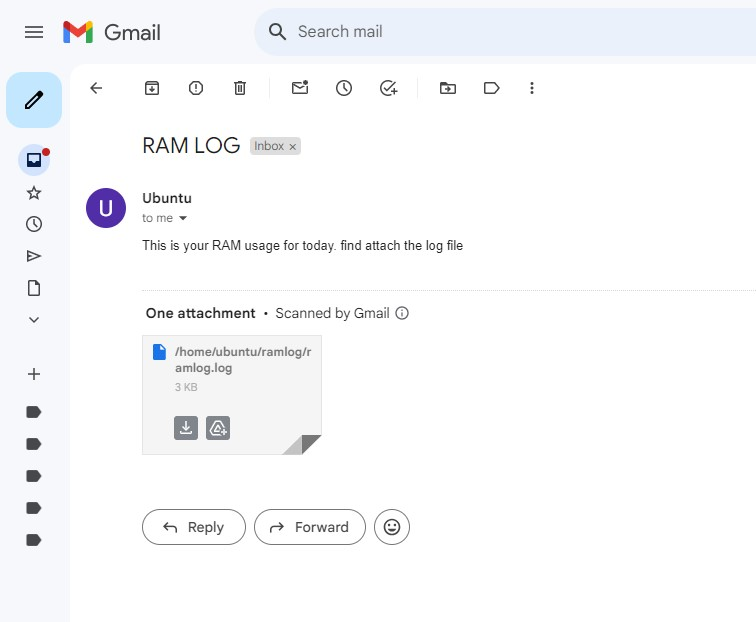

# **CRONJOB AND MAIL AUTOMATION**

## **Project Overview**
In this mini project, I explored **Bash scripting** and **Cron jobs** for automation. I created a **Bash script** that runs **every hour**, saving the system's **memory (RAM) usage** to a log file. At **midnight**, the log file is automatically **emailed** to a specified recipient, and afterward, a script deletes the file to start fresh for the new day.

This setup helps in **monitoring server RAM usage daily**, enabling proactive resource management by identifying when **memory allocation needs to be adjusted**.

Additionally, this project helped me learn the **possibilities and techniques of sending and automating emails from a server**, enhancing my understanding of **server-based email automation**.

---

## **Solution Approach**
Since this was my **first time working with Bash scripting and Crontab**, I couldn't achieve all tasks using a **single script and cron job**. Instead, I divided the tasks into **three separate scripts**, each executed via an individual **Cron job**.

### **1️⃣ RAM Usage Logging**
- **Script**: `ramlog.sh`
- **Purpose**: Runs **hourly**, captures system **RAM usage**, and appends it to `ramlog.log`.
- **Cron Job**: Executes `ramlog.sh` every hour.
  
   

---

### **2️⃣ Email Log File at Midnight**
- **Script**: `ram_mail.sh`
- **Purpose**: Sends the **RAM usage log file (`ramlog.log`)** as an email attachment at **midnight**.
- **Cron Job**: Triggers the script daily at **12:00 AM**.

   

---

### **3️⃣ Log File Cleanup**
- **Script**: `del_log.sh`
- **Purpose**: Deletes `ramlog.log` at **12:02 AM** to ensure the file has been sent before being removed.
- **Cron Job**: Runs **2 minutes past midnight**.

   

---

## **Crontab Configuration**
Here is the **Crontab** setup that schedules the three scripts:

   

---

## **Email Output**
At **midnight**, I receive an automated email containing the **RAM usage log** as an attachment.

   

---

## **Sample Log File**
Here is a sample log file that was automatically sent via email:

📂 **[Click here to view the log file](_home_ubuntu_ramlog_ramlog.log)**

---

### **Conclusion**
This project demonstrates **how to automate system monitoring** using **Bash scripts and Cron jobs**. It ensures **consistent tracking of RAM usage**, allowing for **better resource optimization** on a server.  

Additionally, it provided hands-on experience in **email automation from a server**, which can be useful for **system alerts, notifications, and automated reporting**.  

